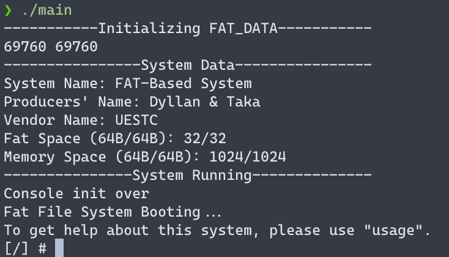
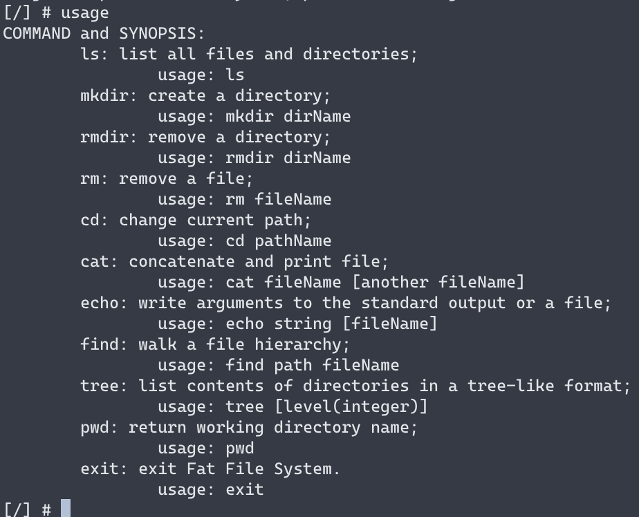
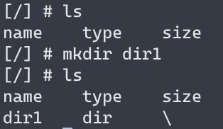
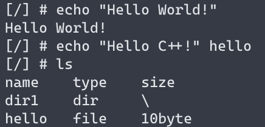
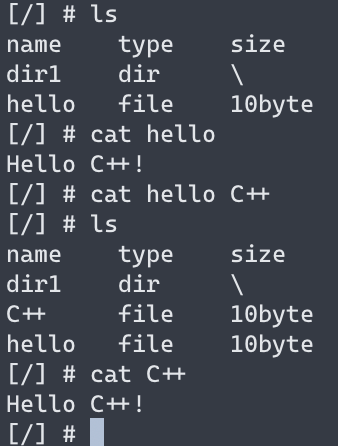
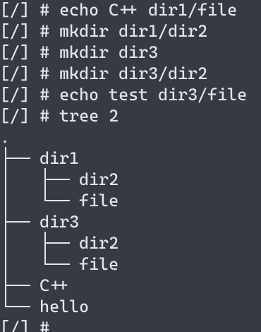
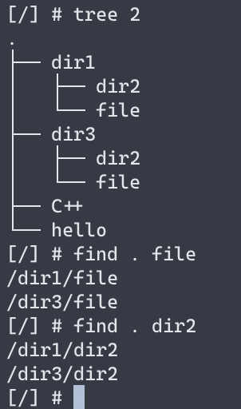
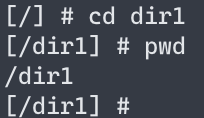
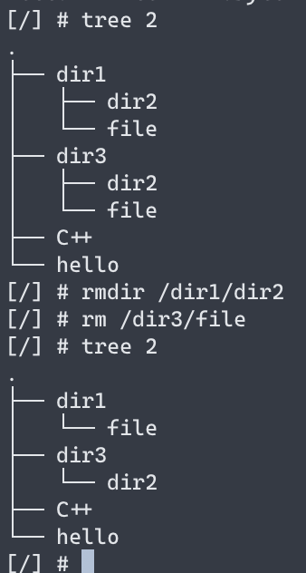
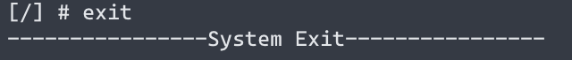

# FatFileSystem

Simple simulator of Fat Filesystem based on C++

## Development Environment

A PC, Visual Studio Code, C++ 17, make

## How to use

Clone the repository:

```bash
git clone https://github.com/DyllanElliia/FatFileSystem.git
cd FatFileSystem
```

You should create a directory named obj:

```bash
mkdir obj
```

Then make it:

```bash
make
```

## Example

After make down, you can use

```bash
./main
```

to start the Filesystem:



After seeing "[/] #", it means you can test the system.

In this system, we've set several commands to control it. You can use the command "usage" to get help:



Just like \*nix, you can use the command "mkdir" to create a directory, and use "ls" to list files and directories:



You can use "echo" to print something to the screen, or use "echo [string] [filename]" to write the string to a file:



If there is a file, the command "cat" can get its content and print it to the screen. Like "echo", you can use "cat [file1] [file2]" to write content from the first file to the second file:



The command "tree [level]" can list all files and directories based on the level:



If you want to find a file or a directory, you can use "find [path] [name]" like:



You can use "cd [path]" to change you path. You can get your current path from the begin of the line or use the command "pwd":



If you want to delete something, please use "rm [path]" for file and "rmdir [path]" for directory:



You can use "exit" to exit the system.


